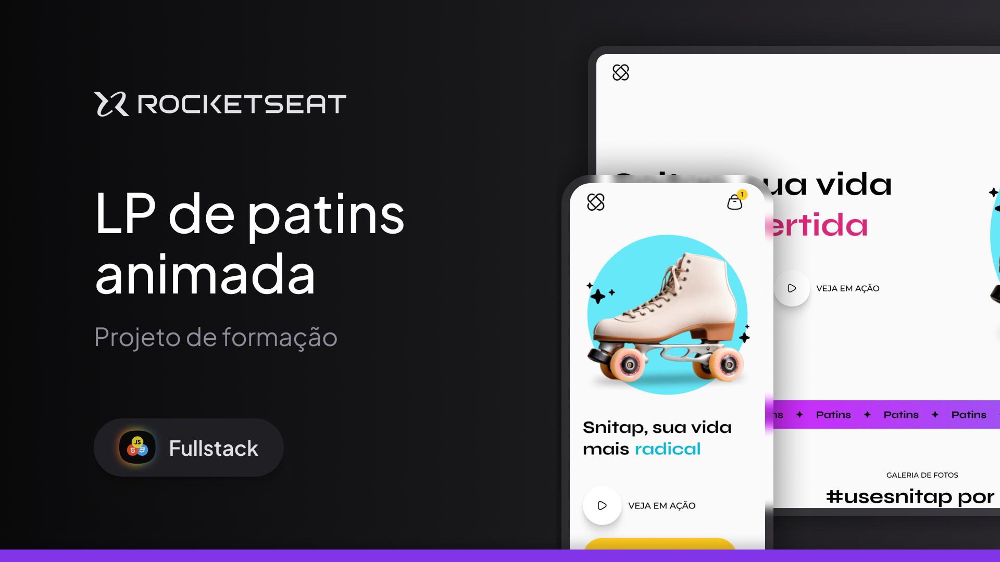

<h1 align="center">
  Snitap
</h1>

## Projeto 💻

O projeto é uma landing page de marketing completa e responsiva de um aplicativo de Karaokê chamado Zingen.

Esse é um desafio prático da formação Full-Stack, um dos conteúdos disponíveis para alunos da Rocketseat.

## Tecnologias

Esse projeto foi desenvolvido com as seguintes tecnologias

- HTML
- CSS

---

## Acessar o Projeto

Para acessar o projeto, basta clicar neste link abaixo:  
<a href="https://pduartesilva2005.github.io/patins-animation/" target="_blank">Ver o projeto online!</a>

Criado por Pedro Duarte
